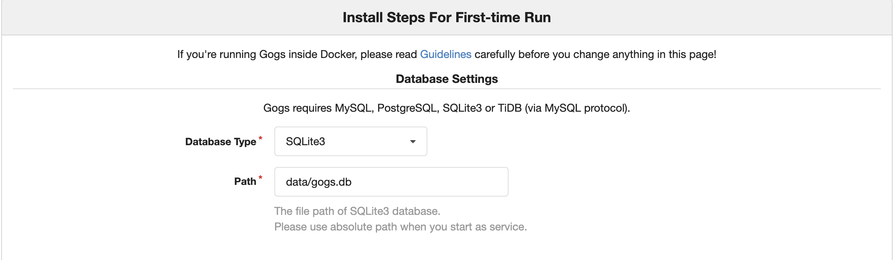

# how to use gogs install a repo server in mac device?
## install docker (you can search in google how to install docker)

## Pull image from Docker Hub.
```shell
docker pull gogs/gogs
```

## Create local directory for volume.
```shell
mkdir -p /tmp/gogs
```

## Use `docker run` for the first time.
```shell
docker run --name=gogs -p 10022:22 -p 3000:3000 -v /tmp/gogs:/data gogs/gogs
```

## Use `docker start` if you have stopped it.
```shell
docker start gogs
```

## login to dashboard
```shell
http://localhost:3000/
```
you will see below page, you can choose "SQLite3" as databaseType, then click "Install"



